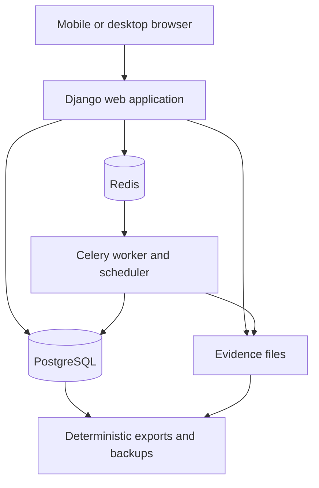

# WorkLedger

[](https://github.com/Maar10Herr/WorkLedger-Public/actions/workflows/ci.yml)
[](LICENSE)
[](docs/ARCHITECTURE.md)
[](https://orcid.org/0009-0005-8721-6588)

A single-owner, self-hosted evidence ledger for work locations, business
travel, expenses, receipts, tax-relevant facts, and employer reimbursement.

> [!IMPORTANT]
> **Experimental self-hosted software.** WorkLedger preserves evidence and
> records deterministic derivations; it does not provide tax, legal,
> accounting, or employment advice. Review exported facts and amounts against
> the rules and evidence applicable to the relevant person and filing period.

**[Start locally](#quick-start)** ·
**[Read the architecture](docs/ARCHITECTURE.md)** ·
**[Download the latest release](https://github.com/Maar10Herr/WorkLedger-Public/releases/latest)**

## Core design

WorkLedger targets one owner on one trusted host, accessed through a mobile or
desktop browser. It combines fast daily entry with an audit-oriented storage
model:

- one-tap work-from-home records and structured journey, expense, receipt, and
  external-activity flows;
- append-only event revisions linked by a globally checked SHA-256 audit chain;
- PostgreSQL constraints that guard revision immutability, event identity, and
  audit-link continuity;
- original-preserving receipt storage with derived previews and thumbnails;
- distinct tax-relevance and employer-reimbursement tracks;
- explicit incomplete, unresolved, derived, confirmed, and overridden states;
- deterministic CSV, JSON, XLSX, SQLite, ZIP, and employer-package exports;
- checksum-verified database-and-file backups with a gated restore path; and
- optional Deutsche Bahn timetable and OpenRouteService lookups with manual
  fallbacks.

## Quick start

The supported deployment path uses Docker with Compose v2. Allow approximately
2 GiB of free space before uploaded evidence and backups.

macOS or Linux:

```sh
./start.sh
```

Windows PowerShell:

```powershell
./start.ps1
```

The start script creates a project-local `.env` with randomly generated
application and database secrets when needed. Open <http://127.0.0.1:8787>,
create the owner PIN, and configure residences, employers, workplaces, and
optional rail passes.

Common operations:

```sh
./start.sh
./stop.sh
docker compose ps
docker compose logs --tail=200 web worker postgres redis
```

`./stop.sh --volumes` removes the database volume. Create and test a backup
before using that option.

## Architecture



The application is a server-rendered Django monolith. Domain boundaries live
under `apps/`: accounts, ledger, travel, evidence, expenses, taxes, and
exports. Redis carries task-queue work; PostgreSQL stores the ledger and audit
state; evidence files retain original uploads. The normal Compose configuration
binds the web service to `127.0.0.1`.

## Evidence integrity

Each event has a stable identity and an ordered revision history. Editing adds
a revision rather than replacing the previous representation. Database guards
reject deletion, mutation of protected revision fields, broken predecessor
links, and event-identity changes. Exports include normalized records and hashes
so a reviewer can trace a derived amount back to its evidence and revision.

These controls provide application-level auditability. Host administrators and
database owners remain inside the trust boundary, and backup integrity still
depends on tested restore procedures and protected media.

## Privacy and deployment boundary

WorkLedger data can contain personal, employment, location, tax, and financial
information. Use a dedicated host or account, a long owner PIN, encrypted
storage where appropriate, and exact allowed-host/CSRF settings. The default
service is loopback-only.

`compose.review.yaml` can expose a temporary trusted-LAN review port without
TLS. For remote access, keep the application behind an authenticated private
network or a correctly configured TLS reverse proxy. The project has not
received an external security audit.

Runtime data belongs outside version control:

```text
.env
workledger-data/
workledger-backups/
*.db  *.sqlite  *.zip  *.xlsx  *.csv  *.pdf
```

## Optional providers

Live train choices use project-local credentials:

```text
DB_TIMETABLES_CLIENT_ID=
DB_TIMETABLES_API_KEY=
```

Road-distance candidates use:

```text
OPENROUTESERVICE_API_KEY=
```

Provider output enters the ledger as an unconfirmed fact until reviewed.
Manual train entry and manually confirmed distance remain available without
provider access.

## Backups and recovery

Create a database-and-file backup with a SHA-256 manifest:

```sh
./backup.sh
./backup.sh /mounted/offline-disk/workledger
```

Restore is explicit and verifies the manifest before replacement:

```sh
./restore.sh --yes /path/to/workledger-YYYYMMDDTHHMMSSZ
```

The previous evidence directory is retained as a timestamped sibling. Validate
the procedure on disposable infrastructure and keep at least one encrypted,
offline copy.

## Tax-rule provenance

[`docs/TAX_RULES_2026.md`](docs/TAX_RULES_2026.md) records the dated German rule
inputs implemented by this release and links each official statutory source.
The ledger stores the rule version used for a derivation so later review can
distinguish contemporaneous facts from subsequent rule changes.

## Development and verification

Use test-only infrastructure. Never aim setup helpers, seed commands, or
mutating probes at a live personal database.

```sh
uv sync --all-groups --frozen
npm ci
npm run build
uv run ruff check .
uv run mypy apps config tests
uv run pytest -q
npm run test:js
```

PostgreSQL constraint tests require a disposable database:

```sh
WORKLEDGER_TEST_DATABASE_URL=postgresql://... \
  uv run pytest -q --ds=config.settings.postgres_test
```

GitHub Actions runs the locked Python/SQLite suite, static analysis,
JavaScript tests, and shell-syntax checks. Browser end-to-end tests additionally
require Playwright.

## Repository map

```text
apps/                 Django domain applications and migrations
config/               Django, Celery, ASGI/WSGI, and environment settings
templates/            server-rendered mobile interface
assets/               Tailwind source
static/               built CSS, application JavaScript, and PWA shell
tests/                unit, integration, property, UI, and optional E2E tests
docker/               entrypoint and database-role initialization
docs/                 architecture and dated tax-rule provenance
*.sh, *.ps1           start, stop, backup, restore, and scheduling tools
```

## Citation

Release metadata is in [`CITATION.cff`](CITATION.cff). Author:
[Maarten Linus Herrmann](https://orcid.org/0009-0005-8721-6588), ORCID
[`0009-0005-8721-6588`](https://orcid.org/0009-0005-8721-6588).

## License and third-party software

WorkLedger is licensed under [GPL-3.0-or-later](LICENSE). Vendored Alpine.js and
HTMX distributions and CSS generated with Tailwind retain their own terms; see
[`THIRD_PARTY_NOTICES.md`](THIRD_PARTY_NOTICES.md). The reciprocal license keeps
distributed variants of the application available under the same terms. Other
dependencies remain subject to the licenses recorded by their distributions
and lockfiles.
